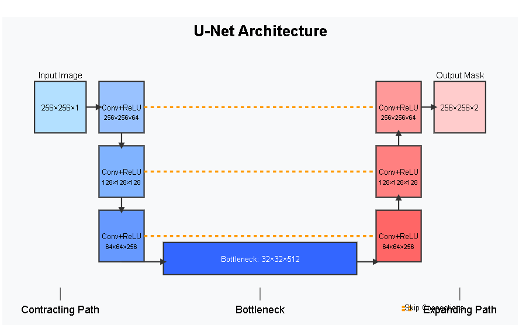

# Unet Arcitecture

The architecture is U Shaped. 
Encoder is the left side of the image.
Decoder is the right side of the image.
## Contracting Path
 1. This takes the image.
 2. Applies convolution (filter that detects the features like edge, tectures etc.)
 3. Repeditly shrings the image, While increases the depth that means 